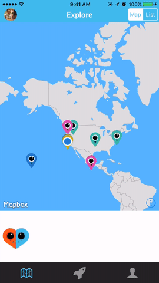
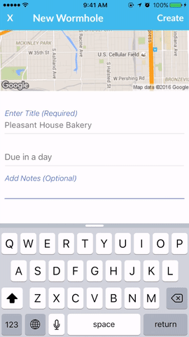
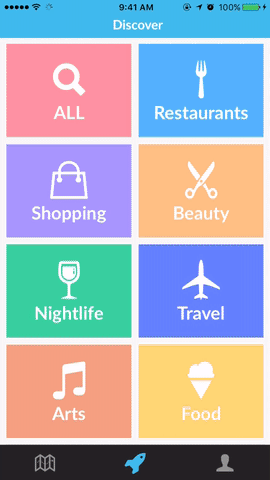

# Wormie

Wormie is a React Native iOS app to request videos and livestreams at specific locations around the world.

## Team

- __Product Owner__: Sunyoung Kim
- __Scrum Master__: Nick Fujita
- __DevOps__: Charlie Harrington
- __Development Team__: Sunyoung Kim, Nick Fujita, Charlie Harrington

## Table of Contents

1. [Usage](#Usage)
2. [Requirements](#requirements)
3. [Development](#development)
	1. [Installing Dependencies](#installing-dependencies)
	2. [Tasks](#tasks)
4. [Team](#team)
5. [Contributing](#contributing)

## Usage

Users can request videos at specific locations with optional deadlines. Users who are near a desired location can respond to an open request and capture a video of the content that the other user requested, creating a "wormhole" connection between those two users. Once a request is fulfilled, all users of the application can view and browse the submitted video wormholes.

Example use cases for Wormie involve capturing a subject or moment of interest at a specific location (e.g. "Is there a line outside this brunch spot right now?"), or a video between 2 separate points of interest (e.g. "I'd like to see a video of walking across the Golden Gate Bridge.")

### Explore



### Open new video requests



### Connect with livestreams


### View completed video requests


### Discover venues



## Requirements

### Frontend

- React Native: 0.15.0
- React Native modules
  - Camera: 0.3.8
  - Collapsible: 0.5.4
  - FacebookSDKCore: 0.0.7
  - FacebookSDKLogin: 0.0.7
  - File-Upload: 1.0.4
  - Google-Place-Autocomplete: 1.1.6
  - Google-Static-Map: 0.1.5
  - Icons: 0.7.0
  - Mapbox-GL: 2.0.0
  - Material-Kit: 0.2.2
  - Safari-View: 0.1.4
  - Scrollable-Tab-View: 0.3.2
  - Video: 0.6.1
  - WebRTC: 0.2.2
  - YouTube: 0.5.0
- Redux: 3.0.4
- Redux-Thunk: 1.0.0
- Socket.io-Client: 1.3.7
- Moment: 2.10.6
- OAuth: 0.9.14
- QueryString: 0.2.0

### Backend

#### RESTful API Server
- Python 3.4.3
- Django: 1.9
- Django REST Framework: 3.3.1
- Postgres

#### Micro-services
- Node
- Express
- GraphicsMagick

### Deployment

- AWS EC2
- Docker
- iOS Store (Wormie is currently in App Review)

## Development

### Installing Dependencies

From within the `orig_client` directory:

```sh
npm install
```

From within the `server` directory:
```sh
pip3 install -r requirements.txt
```

From within the `gm_server` directory:
```sh
npm install
```

From within the `socket_server` directory:
```sh
npm install
```

## Running Locally iOS

1. Download Xcode from the Mac App Store
2. Navigate to the `Wormie.xcodeprog` in `orig_client/ios` folder
3. Open it in Xcode and run the project

### Roadmap

View the project roadmap [here](https://github.com/trusty-cd-rom/wormie/issues)


## Contributing

See [CONTRIBUTING.md](CONTRIBUTING.md) for contribution guidelines.
